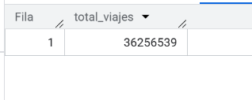
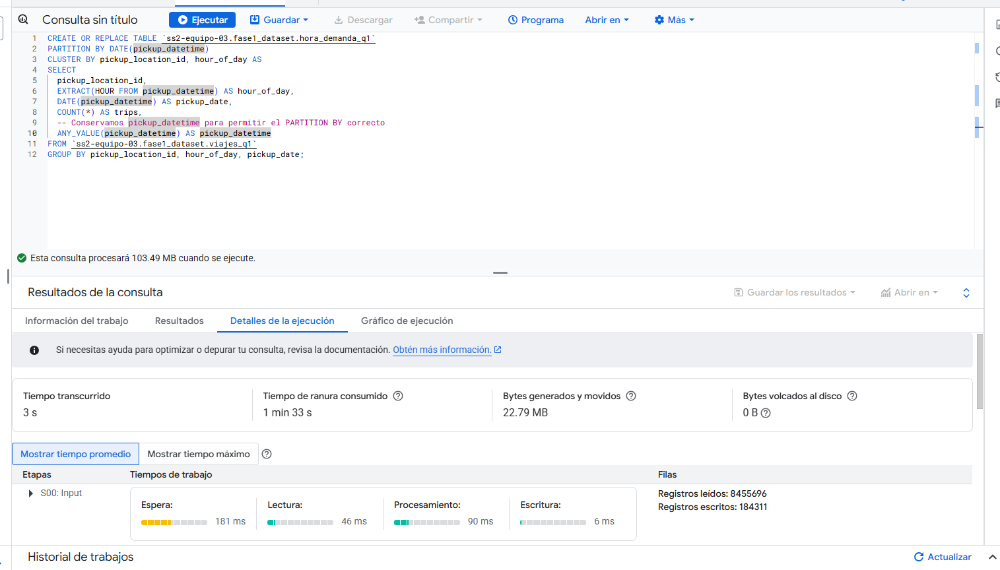
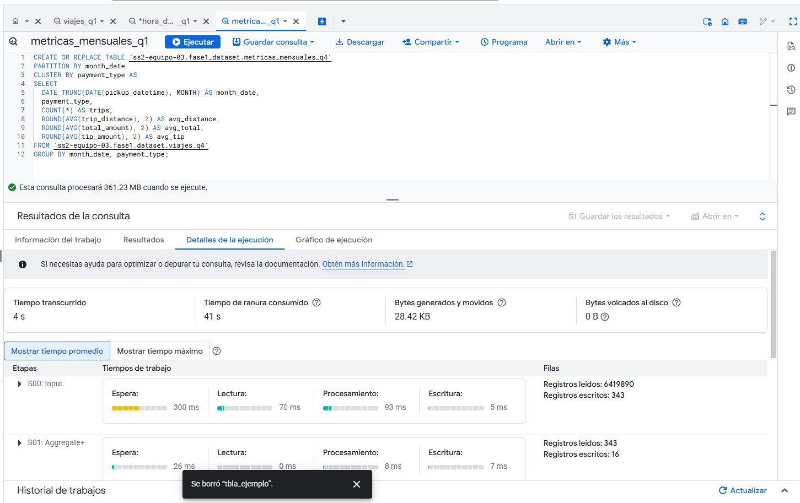

# SS2_2S2025_Grupo 3 – Análisis Exploratorio de Datos NYC Taxi Trips 2022
## Jose Ignacio Martinez Hernandez 201408507

## Dashboard

[haz click](https://lookerstudio.google.com/reporting/63b603ba-f2a6-4c32-b2a3-4154d062d5b3)

## Descripción del Dataset

El proyecto utiliza el dataset público **NYC Taxi Trips 2022** disponible en **Google BigQuery**:

- **Origen:** `bigquery-public-data.new_york_taxi_trips.tlc_yellow_trips_2022`
- **Número de registros:** Más de 100 millones de viajes de taxi reportados en 2022 en la ciudad de Nueva York.### Columnas Principales

| Columna | Descripción |
|--------|-------------|
| tpep_pickup_datetime | Fecha y hora de inicio del viaje |
| tpep_dropoff_datetime | Fecha y hora de fin del viaje |
| passenger_count | Número de pasajeros |
| trip_distance | Distancia recorrida en millas |
| PULocationID | Zona de origen (pickup) |
| DOLocationID | Zona de destino (dropoff) |
| payment_type | Tipo de pago (efectivo, tarjeta, etc.) |
| fare_amount | Tarifa base del viaje |
| extra | Cargos adicionales |
| mta_tax | Impuesto del MTA |
| tip_amount | Propina (solo tarjetas) |
| tolls_amount | Peajes |
| improvement_surcharge | Cargo adicional fijo |
| congestion_surcharge | Cargo por congestión |
| airport_fee | Tarifa adicional para aeropuertos |
| total_amount | Monto total cobrado al pasajero |
| RatecodeID | Código de tarifa aplicada |
| store_and_fwd_flag | Indica si el registro fue almacenado y enviado después |

Este dataset permite analizar patrones temporales, geográficos y económicos de


## 1️ Verificación de registros


### A.  Conteo 
```sql

SELECT COUNT(*) AS total_viajes
FROM `bigquery-public-data.new_york_taxi_trips.tlc_yellow_trips_2022`;

```


### B. Nulos
```sql

SELECT COUNT(*) AS total_viajes
FROM `bigquery-public-data.new_york_taxi_trips.tlc_yellow_trips_2022`;

```


### C. Cantidad
```sql

SELECT COUNT(*) AS total_viajes
FROM `bigquery-public-data.new_york_taxi_trips.tlc_yellow_trips_2022`;

```




## 3.  Consultas SQL y Transformaciones  
Se desarrollaron consultas SQL en BigQuery para extraer y transformar la información de las tablas base.  
Durante este proceso se seleccionaron únicamente los campos relevantes, se estandarizaron valores y se crearon columnas calculadas para enriquecer los resultados.  
Además, se generaron tablas derivadas con menos columnas para optimizar el rendimiento y facilitar los análisis posteriores.

### Consultas con Filtros y Agrupaciones  
Se aplicaron filtros para obtener subconjuntos específicos de datos y se utilizaron agrupaciones mediante la cláusula `GROUP BY` para calcular métricas agregadas como conteos, promedios y sumas.  
Este paso permitió identificar patrones y tendencias en los grupos analizados de manera más eficiente.

### Funciones Temporales y Métricas Descriptivas  
Se emplearon funciones temporales de BigQuery como `DATE_TRUNC` y `EXTRACT`, junto con métricas descriptivas como porcentajes y distribuciones de frecuencia.  
Esto facilitó el análisis del comportamiento de los datos en el tiempo y la obtención de información estadística relevante.

### Limpieza y Preparación de Datos Derivados  
Se realizó un proceso de limpieza de datos que incluyó la eliminación de registros duplicados, la normalización de valores nulos o inconsistentes y la generación de tablas intermedias.  
Gracias a este proceso, los datos quedaron listos para análisis posteriores y visualizaciones, garantizando resultados confiables.


### Tabla de viajes Q2


### Tabla de Hora Demanda Q2



### Tabla de Metricas mensuales



### Tabla de propinas


## Análisis de patrones y tendencias

### Distribución de métodos de pago

```sql
SELECT
  payment_type,
  COUNT(*) AS cantidad_viajes,
  ROUND(100 * COUNT(*) / SUM(COUNT(*)) OVER(), 2) AS porcentaje
FROM `ss2-equipo-03.fase1_dataset.viajes_q2`
GROUP BY payment_type
ORDER BY cantidad_viajes DESC;
```


### Distribución de número de pasajeros

``` sql 

SELECT
  passenger_count,
  COUNT(*) AS cantidad_viajes,
  ROUND(100 * COUNT(*) / SUM(COUNT(*)) OVER(), 2) AS porcentaje
FROM `ss2-equipo-03.fase1_dataset.viajes_q2`
GROUP BY passenger_count
ORDER BY passenger_count;
```


#### rendimineto de la consulta

normal: 


optimizando utilizando tablas temporales: 


### Viajes por mes 

```sql
SELECT
  month_date,
  SUM(trips) AS total_trips
FROM `ss2-equipo-03.fase1_dataset.metricas_mensuales_q2` 
WHERE EXTRACT(YEAR FROM month_date) = 2022
GROUP BY month_date
ORDER BY month_date;

```


### Distribución de Propinas por Mes
```sql

SELECT
  month_date,
  tip_bucket,
  SUM(trips) AS total_trips
FROM `ss2-equipo-03.fase1_dataset.propina_q2` 
WHERE EXTRACT(YEAR FROM month_date) = 2022
GROUP BY month_date, tip_bucket
ORDER BY month_date, total_trips DESC;
```


#### rendimineto de la consulta

normal: 


optimizando utilizando tablas temporales: 


### Relación Tarifa vs. Propina

```sql
SELECT
  month_date,
  payment_type,
  ROUND(SUM(avg_tip) / NULLIF(SUM(avg_total), 0) * 100, 2) AS porcentaje_propina
from `ss2-equipo-03.fase1_dataset.metricas_mensuales_q4`
WHERE EXTRACT(YEAR FROM month_date) = 2022
GROUP BY month_date, payment_type
ORDER BY month_date, payment_type;
```

