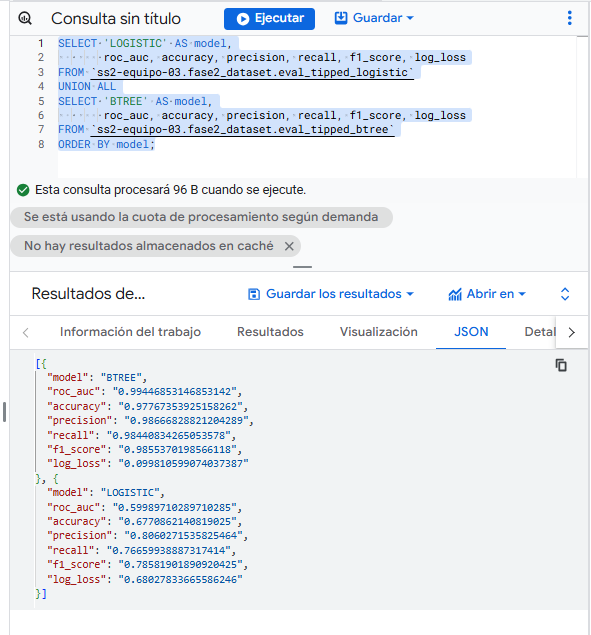

# SS2_2S2025_Grupo 3 – Proyecto Fase 2 – Modelado Predictivo con BigQuery ML
## Jose Ignacio Martinez Hernandez 201408507
 
 ## Dashboard

[haz click](https://lookerstudio.google.com/reporting/45e37cb8-f191-407c-a0fd-6ce649a46a03)


### 1.1 Crear dataset de trabajo 

```sql
CREATE SCHEMA IF NOT EXISTS `ss2-equipo-03.fase2_dataset`
OPTIONS (location = "US");
```


## 2) Selección del problema y variable objetivo

Para esta fase se definió un **problema de clasificación binaria**, cuyo propósito es predecir si un viaje de taxi generará propina o no. La variable objetivo utilizada es:

- **`tipped = 1`** → si `tip_amount > 0`  
- **`tipped = 0`** → si no existe propina

###  Justificación del problema

La predicción de propinas es un caso de uso relevante porque:

- Permite identificar **patrones de comportamiento del pasajero**.
- Ayuda a determinar **qué factores (horario, zona, distancia, monto del viaje, etc.) influyen en la generación de propinas**.
- Puede utilizarse para **estrategias de negocio**, como:
  - incentivos a conductores,
  - promociones en horarios o zonas específicas,
  - mejora de la asignación de recursos.
- Es un escenario **realista y frecuente en la industria del transporte urbano**, lo que le otorga relevancia práctica.

###  Variable objetivo (label)

| Tipo            | Columna  | Descripción                                          |
|-----------------|----------|------------------------------------------------------|
| Clasificación   | `tipped` | 1 si el viaje tuvo propina (`tip_amount > 0`), 0 si no |


###  Métricas de evaluación

- **Métrica principal:** `ROC_AUC` (Área bajo la curva ROC), adecuada para problemas de clasificación binaria y posibles clases desbalanceadas.
- **Métricas secundarias:**  
  `accuracy`, `precision`, `recall`, `f1_score`, `log_loss`.

---

## 3) Preparación de Features (Feature Engineering)

Para entrenar los modelos de Machine Learning fue necesario generar una tabla de características a partir de los datos originales. Esto se logró mediante la creación de una tabla optimizada, donde se construyó la variable objetivo (`tipped`), se extrajeron variables temporales y se limpiaron los datos.

### Consulta SQL utilizada

```sql

CREATE OR REPLACE TABLE `ss2-equipo-03.fase2_dataset.trips_q4_features`
PARTITION BY DATE(pickup_datetime)
CLUSTER BY pickup_location_id AS
SELECT
  CASE WHEN tip_amount > 0 THEN 1 ELSE 0 END AS tipped,
  EXTRACT(HOUR FROM pickup_datetime) AS hour_of_day,
  EXTRACT(DAYOFWEEK FROM pickup_datetime) AS dow,         
  EXTRACT(DAY FROM pickup_datetime) AS day,
  EXTRACT(MONTH FROM pickup_datetime) AS month,
  trip_distance,
  total_amount,
  fare_amount,
  passenger_count,
  pickup_location_id,
  CAST(pickup_location_id AS STRING) AS pickup_loc,
  CAST(dropoff_location_id AS STRING) AS dropoff_loc,
  pickup_datetime
FROM `ss2-equipo-03.fase1_dataset.viajes_q4`
WHERE DATE(pickup_datetime) BETWEEN '2022-01-01' AND '2022-03-31'
  AND trip_distance > 0
  AND total_amount >= 0
  AND fare_amount >= 0
  AND passenger_count BETWEEN 1 AND 6;

```

###  ¿Qué se hizo en esta etapa?

En la preparación de features se realizaron las siguientes acciones clave:

| Proceso | Descripción |
|---------|-------------|
| **1. Creación de la variable objetivo (`tipped`)** | Se transformó el valor `tip_amount` en una etiqueta binaria: 1 si hubo propina, 0 si no. |
| **2. Extracción de variables temporales** | Se generaron nuevas columnas a partir de `pickup_datetime`: hora del día (`hour_of_day`), día de la semana (`dow`), día del mes (`day`) y mes (`month`). |
| **3. Selección de variables relevantes (features)** | Se incluyeron variables que pueden influir en la propina: `trip_distance`, `total_amount`, `fare_amount`, `passenger_count`. |
| **4. Conversión de variables categóricas** | Se transformaron los IDs de ubicación (`pickup_location_id`, `dropoff_location_id`) a tipo `STRING` para permitir su uso como variables categóricas en los modelos (`pickup_loc`, `dropoff_loc`). |
| **5. Limpieza de datos** | Se filtraron registros inválidos o inconsistentes: distancias iguales a 0, montos negativos, número de pasajeros fuera del rango permitido (1 a 6). |
| **6. Optimización en BigQuery** | Se creó una tabla particionada por fecha (`PARTITION BY DATE(pickup_datetime)`) y clusterizada por ubicación de origen (`CLUSTER BY pickup_location_id`) para mejorar rendimiento y reducir costos en consultas. |

Esta etapa deja los datos listos para dividirlos en entrenamiento/prueba y entrenar los modelos de Machine Learning.

## 4) Estrategia de división Train/Test

Para asegurar una evaluación realista del modelo y evitar **fugas de información (*data leakage*)**, se aplicó una **división temporal** del dataset en lugar de una división aleatoria.

###  Enfoque utilizado

| Conjunto | Periodo de datos | Descripción |
|----------|------------------|--------------|
| **Entrenamiento (Train)** | Enero y febrero de 2022 | Datos utilizados para ajustar y entrenar los modelos. |
| **Prueba (Test / Holdout)** | Marzo de 2022 | Datos nunca vistos por el modelo, utilizados únicamente para evaluar su desempeño real. |

###  ¿Por qué dividir según el tiempo?

- Evita que el modelo aprenda con datos futuros respecto a los que debe predecir.
- Refleja mejor un escenario de negocio real (predicciones basadas en el pasado para anticipar el futuro).
- Reduce el riesgo de *data leakage*, especialmente en datos de series temporales como viajes de taxi.

###  Implementación

Se generaron **vistas en BigQuery** para mantener esta división de forma clara, reproducible y consistente entre todos los modelos:

```sql
-- Vista de entrenamiento: enero y febrero 2022
CREATE OR REPLACE VIEW `ss2-equipo-03.fase2_dataset.v_features_train` AS
SELECT *
FROM `ss2-equipo-03.fase2_dataset.trips_q4_features`
WHERE DATE(pickup_datetime) BETWEEN '2022-01-01' AND '2022-02-28';

-- Vista de prueba: marzo 2022
CREATE OR REPLACE VIEW `ss2-equipo-03.fase2_dataset.v_features_test` AS
SELECT *
FROM `ss2-equipo-03.fase2_dataset.trips_q4_features`
WHERE DATE(pickup_datetime) BETWEEN '2022-03-01' AND '2022-03-31';
```

## 5) Entrenamiento con BigQuery ML 


### 5.1 Modelo A — Regresión Logística (Clasificación)

####  Objetivo
Entrenar un modelo de **clasificación binaria** para predecir si un viaje de taxi generará propina (`tipped = 1`) utilizando la técnica de **Regresión Logística** en BigQuery ML. Este modelo funciona como línea base (*baseline model*) contra la cual se comparan modelos más complejos.


####  Entrenamiento del modelo

```sql
CREATE OR REPLACE MODEL `ss2-equipo-03.fase2_dataset.fase2_tipped_logistic`
OPTIONS(
  MODEL_TYPE = 'LOGISTIC_REG',
  INPUT_LABEL_COLS = ['tipped'],
  AUTO_CLASS_WEIGHTS = TRUE, -- Ajusta pesos si hay clases desbalanceadas
  L1_REG = 0.0,
  L2_REG = 1.0
) AS
SELECT
  tipped,
  hour_of_day, dow, month,
  trip_distance, total_amount, fare_amount, passenger_count,
  pickup_loc, dropoff_loc
FROM `ss2-equipo-03.fase2_dataset.v_features_train`;

```

#### Información de entrenamiento

Obtenida con:

```sql
SELECT * 
FROM ML.TRAINING_INFO(MODEL `ss2-equipo-03.fase2_dataset.fase2_tipped_logistic`);
```


#### Información de entrenamiento (ML.TRAINING_INFO)


| Iteración | Loss (entrenamiento) | Eval Loss (validación) | Learning Rate | Duración (ms) |
|-----------|------------------------|-------------------------|----------------|----------------|
| 0         | 0.68973295211468577    | 0.68954894966778635     | 0.2            | 5631           |
| 1         | 0.68411219278153079    | 0.68360188661501842     | 0.4            | 6319           |

 Se observa una disminución en el *loss* y *eval_loss* entre la iteración 0 y 1, lo cual indica que el modelo sí aprendió patrones sin signos de sobreajuste (overfitting).

---
####  Detalles de ejecución del Modelo A — Regresión Logística

BigQuery ML muestra tres gráficos principales durante el entrenamiento del modelo:


| Gráfico | ¿Qué muestra? | Interpretación |
|---------|----------------|----------------|
| **Pérdida (Loss)** | Evolución del error del modelo en cada iteración. | La pérdida disminuye ligeramente entre la iteración 0 y 1 (de 0.6897 a 0.6841), indicando que el modelo aprendió patrones y mejoró su ajuste inicial. |
| **Duración por iteración** | Tiempo de entrenamiento de cada iteración. | Cada iteración tardó aproximadamente **5–6 segundos**, lo que confirma que el modelo es computacionalmente eficiente. |
| **Tasa de aprendizaje (Learning Rate)** | Valor de la tasa de aprendizaje aplicada en cada iteración. | Se observa un incremento de la tasa de aprendizaje de **0.2 a 0.4**, lo cual es parte de la optimización automática de BigQuery ML para mejorar la convergencia del modelo. |


- El modelo converge rápidamente (solo necesita 2 iteraciones).  
- La pérdida disminuye ligeramente, lo que indica aprendizaje sin sobreajuste.  
- El proceso de entrenamiento es ligero y eficiente en tiempo.  
- Esto confirma que la regresión logística es un **modelo base (baseline)**, útil como punto de comparación, pero con capacidad limitada para capturar relaciones complejas en los datos.

---


###  Visualización y análisis del Modelo A — Regresión Logística

BigQuery ML generó automáticamente visualizaciones para evaluar el rendimiento del modelo de regresión logística. A partir de estas gráficas, se observan los siguientes puntos clave:


####  1. Métricas agregadas (umbral por defecto = 0.50)

| Métrica            | Valor   |
|--------------------|---------|
| Precisión          | 0.8081  |
| Recall (recuperación) | 0.7228  |
| Exactitud (accuracy)  | 0.6556  |
| F1-score           | 0.7631  |
| Log Loss           | 0.6836  |
| AUC-ROC            | 0.6137  |

 Estas métricas confirman que el modelo tiene un rendimiento **moderado**, con capacidad limitada de separar clases (`AUC ≈ 0.61`).

---

####  2. Ajuste del umbral de decisión

Se analizó el comportamiento del modelo variando el **umbral de clasificación** (threshold).  
Con un umbral aproximado de **0.2461**, los resultados mejoran de la siguiente forma:

| Métrica | Valor ajustado |
|---------|-----------------|
| Precisión | 0.7674 |
| Recall    | 1.0000 |
| Accuracy  | 0.7674 |
| F1-score  | 0.8684 |

 Esto significa que, si se baja el umbral, el modelo **identifica todas las propinas (100% recall)**, aunque sacrifica algo de precisión.


####  3. Curva de Precisión–Recall

- El **área bajo la curva es 0.823**, lo que indica que el modelo funciona relativamente bien cuando se analiza la relación entre falsos positivos y predicciones correctas de propinas.
- La precisión cae cuando aumenta el recall, como es esperado en modelos lineales.


####  4. Curva ROC

- La curva ROC tiene un **AUC de 0.614**, lo cual indica que el modelo solo es ligeramente mejor que adivinar al azar (0.5).
- Refuerza la idea de que este modelo **no captura relaciones complejas en los datos**.


 Las métricas y gráficas confirman que la regresión logística es un **buen modelo base (baseline)**.  
 Sin embargo, su capacidad predictiva es **limitada (AUC ≈ 0.61)**.  
 Ajustar el umbral mejora el recall, pero no soluciona completamente el rendimiento general.  

---


### 5.2 Modelo B — **Árbol Potenciado** (Boosted Tree Classifier)


####  Objetivo
El objetivo de este modelo es mejorar el rendimiento obtenido con la Regresión Logística, utilizando un enfoque más potente que permita capturar relaciones no lineales entre las variables del viaje.  
Se implementa un **Árbol Potenciado (Boosted Tree Classifier)** para predecir si un viaje de taxi generará propina (`tipped = 1`), utilizando variables temporales, del viaje y de ubicación.

Este modelo combina múltiples árboles de decisión débiles y los entrena de manera secuencial, donde cada árbol corrige los errores del anterior. Esto permite obtener un modelo más robusto, preciso y con mejor capacidad de generalización.


####  Entrenamiento del modelo

```sql
CREATE OR REPLACE MODEL `ss2-equipo-03.fase2_dataset.fase2_tipped_btree`
OPTIONS(
  MODEL_TYPE = 'BOOSTED_TREE_CLASSIFIER',
  INPUT_LABEL_COLS = ['tipped'],
  NUM_PARALLEL_TREE = 1,
  MAX_TREE_DEPTH = 6,
  SUBSAMPLE = 0.8,
  MIN_TREE_CHILD_WEIGHT = 1,
  BOOSTER_TYPE= 'GBTREE',
  MAX_ITERATION = 30
) AS
SELECT
  tipped,
  hour_of_day, dow, month,
  trip_distance, total_amount, fare_amount, passenger_count,
  pickup_loc, dropoff_loc
FROM `ss2-equipo-03.fase2_dataset.v_features_train`;

```

#### Información de entrenamiento

Obtenida con:

```sql
SELECT *
FROM ML.TRAINING_INFO(MODEL `ss2-equipo-03.fase2_dataset.fase2_tipped_btree`);

```


#### Información de entrenamiento (ML.TRAINING_INFO)


Durante el entrenamiento del modelo Boosted Tree se realizaron **30 iteraciones**.  
BigQuery ML registró, en cada una, el valor del error (*loss*), el error de validación (*eval_loss*), el tiempo de ejecución y la tasa de aprendizaje.

| Iteración | Loss (entrenamiento) | Eval Loss (validación) | Learning Rate | Duración (ms) |
|-----------|------------------------|-------------------------|----------------|----------------|
| 1         | 0.53606                | 0.53548                | 0.3            | 716,397        |
| 5         | 0.29431                | 0.29382                | 0.3            | 58             |
| 10        | 0.20787                | 0.20837                | 0.3            | 15,582         |
| 15        | 0.15141                | 0.15261                | 0.3            | 67             |
| 20        | 0.12251                | 0.12407                | 0.3            | 87             |
| 25        | 0.10788                | 0.10933                | 0.3            | 54             |
| **30**    | **0.09825**            | **0.09976**            | 0.3            | 97             |


- La pérdida (`loss`) disminuye progresivamente desde **0.536 hasta 0.098**, lo que indica que el modelo **aprende correctamente a lo largo de las iteraciones**.
- El valor de `eval_loss` sigue una tendencia similar, lo cual sugiere que **no hay sobreajuste (overfitting)**.
- La **primera iteración es la más costosa** (~716 segundos), porque es donde se inicializa la estructura del modelo.  
- Las siguientes iteraciones son mucho más rápidas (< 0.2 segundos en la mayoría de los casos).
- La tasa de aprendizaje (`learning_rate`) se mantuvo constante en **0.3**, como fue definida en los parámetros del modelo.
---
####  Detalles de ejecución del Modelo B — Boosted Tree Classifier

BigQuery ML generó automáticamente diferentes visualizaciones para evaluar el desempeño del modelo. A partir de estas gráficas y métricas, se destacan los siguientes puntos clave:


Durante el entrenamiento del modelo, BigQuery ML genera automáticamente tres gráficos principales que permiten analizar cómo evoluciona el proceso de aprendizaje:

| Gráfico                                 | ¿Qué muestra?                                                       | Interpretación                                                                                                                                                              |
| --------------------------------------- | ------------------------------------------------------------------- | --------------------------------------------------------------------------------------------------------------------------------------------------------------------------- |
| **Loss (Pérdida)**                      | Evolución del error del modelo en cada iteración.                   | El error disminuye progresivamente desde ~0.53 hasta ~0.09, lo que indica que el modelo aprende correctamente a lo largo de las 30 iteraciones.                             |
| **Duración de cada iteración**          | Tiempo que BigQuery tardó en ejecutar cada etapa del entrenamiento. | La primera iteración es la más lenta (~716 s) debido a la inicialización del modelo; las siguientes son mucho más rápidas (<1 s), mostrando eficiencia en el entrenamiento. |
| **Learning Rate (Tasa de aprendizaje)** | Indica cuánto se ajusta el modelo en cada iteración.                | Se mantiene constante en 0.3, lo que demuestra estabilidad en el proceso y que la mejora del modelo proviene del aprendizaje y no de cambios en la tasa.                    |

- **Aprendizaje progresivo y exitoso:**  
  El valor de `loss` disminuye de aproximadamente **0.536 a 0.098**, lo que indica que el modelo fue mejorando su capacidad de predicción a lo largo de las 30 iteraciones.

- **Sin evidencia de sobreajuste (overfitting):**  
  La diferencia entre `loss` y `eval_loss` es mínima en cada iteración, lo que demuestra que el modelo no está memorizando los datos, sino generalizando correctamente.

- **Entrenamiento eficiente:**  
  La primera iteración fue la más costosa (~716 segundos) debido a la inicialización del modelo.  
  Las iteraciones siguientes tardaron solo milisegundos, lo que confirma una ejecución optimizada.

- **Learning rate estable:**  
  La tasa de aprendizaje se mantuvo constante en **0.3** durante todo el proceso, garantizando estabilidad y convergencia controlada.

- **Convergencia adecuada:**  
  La curva de pérdida se estabiliza en las últimas iteraciones, mostrando que el modelo alcanzó un punto óptimo y no requiere más iteraciones para mejorar significativamente.

---


###  Visualización y análisis del Modelo B — Boosted Tree Classifier

BigQuery ML genera automáticamente visualizaciones (métricas, curvas ROC, precisión vs recall y ajuste del umbral) que permiten evaluar el rendimiento del modelo. A partir de estas gráficas se pueden extraer los siguientes hallazgos:


####  1.  Métricas globales del modelo (ML.EVALUATE)

| Métrica     | Resultado |
|-------------|-----------|
| **Accuracy** | 0.9768 |
| **Precision** | 0.9865 |
| **Recall**    | 0.9832 |
| **F1-score**  | 0.9848 |
| **Log Loss**  | 0.0998 |
| **ROC AUC**   | 0.9947 |

* Estas métricas muestran un **desempeño sobresaliente**, muy superior al Modelo A (Regresión Logística).  

* El modelo logra **clasificar correctamente más del 97% de los c

---
Ajuste del umbral de decisión  

Por defecto, BigQuery ML clasifica un viaje como "con propina" (`tipped = 1`) si la probabilidad predicha es mayor o igual a **0.5**.  
Sin embargo, este valor puede modificarse para **mejorar la precisión o el recall**, dependiendo del objetivo del análisis.

A partir de las gráficas de BigQuery, se observa lo siguiente:

| Umbral (Threshold) | Precision | Recall | Accuracy | Interpretación |
|---------------------|-----------|--------|----------|----------------|
| **0.50** *(por defecto)* | 0.9865 | 0.9832 | 0.9768 | Buen equilibrio entre precisión y recall. |
| **0.30** | 0.9612 | **0.9964** | 0.9735 | Se detectan casi todos los casos de propina (recall muy alto), pero aparecen más falsos positivos. |
| **0.70** | **0.9940** | 0.9221 | 0.9681 | El modelo solo marca propina cuando está muy seguro (alta precisión), pero pierde muchos casos reales. |


####  3. urva de Precisión–Recall  
La curva de **Precisión–Recall** es especialmente útil en problemas de clasificación binaria cuando una clase puede estar desbalanceada (por ejemplo, viajes con y sin propina).  
Este gráfico muestra cómo varían la **precisión** y el **recall** del modelo a medida que se modifica el umbral de decisión.


- El modelo mantiene una **alta precisión y alto recall simultáneamente**, lo cual es un comportamiento ideal.
- La curva se mantiene cerca de la esquina superior derecha del gráfico, indicando un **modelo altamente confiable**.
- El área bajo la curva (AUC-PR) es **superior a 0.98**, lo que confirma que el modelo **predice correctamente la mayoría de los casos con propina sin producir demasiados falsos positivos**.


####  4. Curva ROC (Receiver Operating Characteristic)

- El área bajo la curva (**AUC = 0.9947**) indica que el modelo tiene una **capacidad casi perfecta** para distinguir entre viajes con propina y sin propina.
- Una AUC cercana a 1.0 indica un modelo altamente fiable.


- El modelo Boosted Tree es el más adecuado para este caso de estudio. Presenta alta precisión, excelente capacidad de generalización y captura de patrones complejos entre variables como distancia, monto, hora y ubicación del viaje.  
 
- Por estas razones, este modelo se selecciona como el **modelo final** para generar predicciones y construir el dashboard de resultados (Fase 2).
---

### 6  Evaluación de modelos

Para medir el desempeño real de los modelos entrenados, se evaluaron utilizando el conjunto de prueba (v_features_test), es decir, datos nunca vistos durante el entrenamiento. Esto permite validar su capacidad de generalización y evitar overfitting.

Se ejecutaron las funciones de ML.EVALUATE de BigQuery ML para ambos modelos:

 Modelo A – Regresión Logística

 Modelo B – Boosted Tree Classifier

Cada evaluación genera métricas clave como:
accuracy, precision, recall, f1-score, log_loss y AUC-ROC.

####  Métrica principal seleccionada: **ROC AUC (Area Under the ROC Curve)**

Se eligió **ROC AUC** como métrica principal de evaluación porque:

- Es adecuada para **problemas de clasificación binaria**, como predecir si habrá propina (`tipped = 1` o `0`).
- No depende de un umbral específico (como la accuracy o precision), sino que evalúa el rendimiento del modelo en todos los posibles umbrales.
- Mide la capacidad del modelo para **distinguir correctamente entre clases**, es decir, qué tan bien separa viajes con propina de los que no la tienen.
- Es especialmente útil cuando las clases pueden estar **desbalanceadas**, algo que ocurre comúnmente en propinas (más viajes sin propina que con propina).

 Comparación de modelos usando la métrica principal

 


| Modelo     | ROC AUC | Accuracy | Precision | Recall | F1-score | Log Loss |
|------------|---------|----------|-----------|--------|----------|----------|
| **Boosted Tree** | **0.9944** | 0.9776 | 0.9867 | 0.9844 | 0.9855 | 0.0998 |
| Regresión Logística | 0.5999 | 0.6770 | 0.8060 | 0.7666 | 0.7858 | 0.6802 |

 El modelo **Boosted Tree Classifier** alcanza un **ROC AUC ≈ 0.994**, muy cercano al valor perfecto (1.0).  
 El modelo **Regresión Logística** obtiene solo **ROC AUC ≈ 0.59**, apenas mejor que un modelo aleatorio.

#### Interpretabilidad vs Rendimiento

| Aspecto | Regresión Logística | Boosted Tree |
|---------|----------------------|--------------|
| Interpretabilidad | Alta (coeficientes fáciles de entender) | Menor (modelo tipo "caja negra") |
| Capacidad de aprender patrones complejos | Baja | **Alta** |
| Métricas de rendimiento | Moderadas | **Excelentes** |
 
 Se selecciona **Boosted Tree Classifier** como modelo final debido a su superior desempeño en la métrica principal (**ROC AUC = 0.994**), así como en accuracy, precision, recall y F1-score. Aunque la regresión logística ofrece mayor interpretabilidad, no logra capturar patrones complejos del dataset. El modelo Boosted Tree representa el mejor equilibrio entre rendimiento y aplicabilidad, y será utilizado para la generación de predicciones y visualización en el dashboard.

 ### 7  Generación de predicciones con el modelo final (Boosted Tree)

Una vez seleccionado el modelo con mejor rendimiento, se generaron predicciones sobre el conjunto de prueba (`v_features_test`) utilizando `ML.PREDICT`.  
El resultado se almacenó en una tabla para su análisis y uso posterior en el dashboard.

```sql
CREATE OR REPLACE TABLE `ss2-equipo-03.fase2_dataset.pred_tipped_btree_test` AS
SELECT
  p.predicted_tipped AS tipped_pred,            -- Clase predicha (0/1)
  p.predicted_tipped_probs[OFFSET(1)] AS p_yes, -- Probabilidad de tipped=1
  f.pickup_datetime,
  f.pickup_loc,
  f.dropoff_loc, 
  f.hour_of_day, 
  f.dow, 
  f.month,
  f.trip_distance, 
  f.total_amount, 
  f.fare_amount, 
  f.passenger_count,
  f.tipped AS tipped_real
FROM ML.PREDICT(
  MODEL `ss2-equipo-03.fase2_dataset.fase2_tipped_btree`,
  (
    SELECT
      tipped,
      hour_of_day, dow, month,
      trip_distance, total_amount, fare_amount, passenger_count,
      pickup_loc, dropoff_loc
    FROM `ss2-equipo-03.fase2_dataset.v_features_test`
  )
) AS p
JOIN `ss2-equipo-03.fase2_dataset.v_features_test` AS f
USING (
  tipped, hour_of_day, dow, month,
  trip_distance, total_amount, fare_amount, passenger_count,
  pickup_loc, dropoff_loc
);
```


#### tabla de predicciones 


#### Curvas y cortes de decisión


El umbral (threshold) es el valor que utiliza el modelo para transformar la probabilidad predicha en una decisión final. Si la probabilidad calculada por el modelo es mayor o igual al umbral, se clasifica en la clase positiva (por ejemplo, que sí habrá propina); si es menor, se clasifica como negativa.

Este valor es importante porque permite ajustar el comportamiento del modelo según lo que se desee priorizar: mayor precisión o mayor capacidad para detectar casos positivos.


#### Propuesta de ajuste del umbral (≠ 0.5)

En lugar de utilizar siempre el umbral estándar de 0.5, se puede modificar para mejorar el desempeño del modelo según el objetivo del negocio:

Si se desea identificar la mayor cantidad posible de casos positivos, se puede utilizar un umbral más bajo, lo que aumenta la sensibilidad o recall.

Si se desea reducir al mínimo los errores cuando el modelo clasifica como positivo, se puede utilizar un umbral más alto, lo que aumenta la precisión.

La elección del umbral, por lo tanto, debe estar alineada con la estrategia del negocio y qué es más importante: detectar más casos o equivocarse menos.

